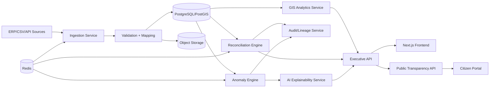

# System Architecture

## Security & Governance
- JWT auth, RBAC, SSO-ready OIDC adapter
- Immutable audit event ledger table + hash chain
- Row-level security by jurisdiction scope
- KMS-backed encryption at rest and TLS in transit

## Observability
- OpenTelemetry tracing
- Structured JSON logs
- Prometheus metrics + Grafana dashboards
- Health probes: liveness/readiness/startup
